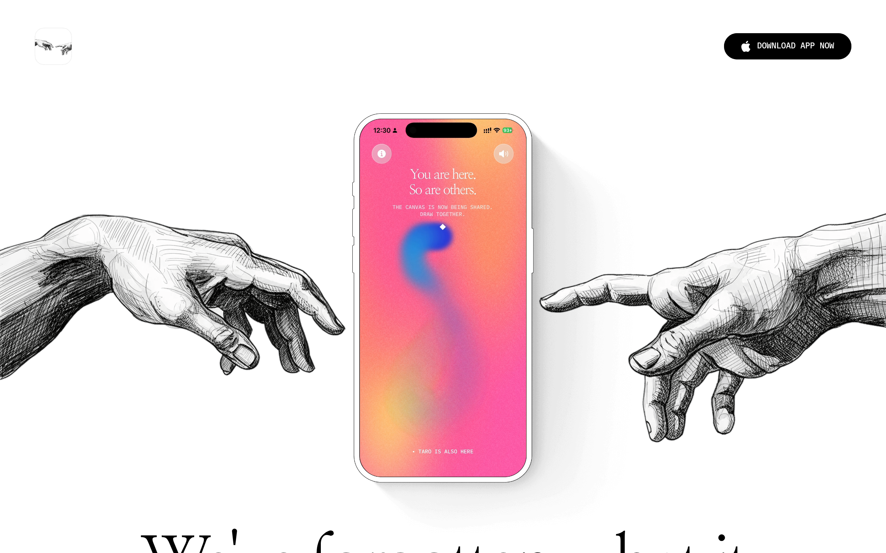

# interludeapp DESIGN.md

> Auto-generated design system — reverse-engineered via static analysis by skillui.
> Frameworks: None detected
> Colors: 3 · Fonts: 2 · Components: 1
> Icon library: not detected · State: not detected
> Primary theme: light · Dark mode toggle: no · Motion: none

## Visual Reference

**Match this design exactly** — study colors, fonts, spacing, and component shapes before writing any UI code.



---

## 1. Visual Theme & Atmosphere

This is a **light-themed** interface with a neutral, approachable feel. The light background emphasizes content clarity. Typography uses **Nanum Myeongjo** throughout — a technical, developer-focused choice that maintains consistency. Spacing follows a **5px base grid** (standard density), with scale: 5, 10, 20, 25, 30, 40, 50, 60px.

---

## 2. Color Palette & Roles

| Token | Hex | Role | Use |
|---|---|---|---|
| background | `#ffffff` | background | Page background, darkest surface |
| border-color | `#000000` | text-primary | Headings and body text |
| info | `#0000ee` | info | Informational highlights |

### CSS Variable Tokens

```css
--border-bottom-width: 1px;
--border-color: #000;
--border-left-width: 1px;
--border-right-width: 1px;
--border-style: solid;
--border-top-width: 1px;
--framer-text-background-color: initial;
--framer-text-background-radius: initial;
--framer-text-background-corner-shape: initial;
--framer-text-background-padding: initial;
```


---

## 3. Typography Rules

**Font Stack:**
- **Nanum Myeongjo** — Heading 1, Heading 2, Heading 3
- **IBM Plex Mono** — Body, Caption, Code

**Font Sources:**

```css
@font-face {
  font-family: "IBM Plex Mono";
  src: url("fonts/IBMPlexMono-Bold.ttf") format("truetype");
  font-weight: 700;
}
@font-face {
  font-family: "IBM Plex Mono";
  src: url("fonts/IBMPlexMono-Regular.ttf") format("truetype");
  font-weight: 400;
}
@font-face {
  font-family: "Nanum Myeongjo";
  src: url("fonts/NanumMyeongjo-Bold.ttf") format("truetype");
  font-weight: 700;
}
@font-face {
  font-family: "Nanum Myeongjo";
  src: url("fonts/NanumMyeongjo-Regular.ttf") format("truetype");
  font-weight: 400;
}
@font-face {
  font-family: "Inter";
  src: url("fonts/Inter-Bold.ttf") format("truetype");
  font-weight: 700;
}
@font-face {
  font-family: "Inter";
  src: url("fonts/Inter-Regular.ttf") format("truetype");
  font-weight: 400;
}
```

| Role | Font | Size | Weight |
|---|---|---|---|
| Heading 1 | Nanum Myeongjo | calc(var(--framer-blockquote-font-size,var(--framer-font-size,16px))*var(--framer-font-size-scale,1)) | 700 |
| Heading 2 | Nanum Myeongjo | calc(var(--framer-link-hover-font-size,var(--framer-blockquote-font-size,var(--framer-font-size,16px)))*var(--framer-font-size-scale,1)) | 700 |
| Heading 3 | Nanum Myeongjo | calc(var(--framer-link-current-font-size,var(--framer-link-font-size,var(--framer-font-size,16px)))*var(--framer-font-size-scale,1)) | 700 |
| Body | IBM Plex Mono | calc(var(--framer-link-hover-font-size,var(--framer-link-current-font-size,var(--framer-link-font-size,var(--framer-font-size,16px))))*var(--framer-font-size-scale,1)) | 400 |
| Caption | IBM Plex Mono | var(--framer-font-size,16px) | 400 |
| Code | IBM Plex Mono | 14px | 400 |

**Typographic Rules:**
- Use **Nanum Myeongjo** for all text — do not mix font families
- Maintain consistent hierarchy: no more than 3-4 font sizes per screen
- Headings use bold (600-700), body uses regular (400)
- Line height: 1.5 for body text, 1.2 for headings
- Use color and opacity for secondary hierarchy, not additional font sizes


---

## 4. Component Stylings

### Media (1)

**Image** — `html`


---

## 5. Layout Principles

- **Base spacing unit:** 5px
- **Spacing scale:** 5, 10, 20, 25, 30, 40, 50, 60, 70, 80, 100
- **Border radius:** 40px, inherit, 26px
- **Max content width:** 1199.98px

**Spacing as Meaning:**
| Spacing | Use |
|---|---|
| 2.5-5px | Tight: related items within a group |
| 10px | Medium: between groups |
| 15-20px | Wide: between sections |
| 30px+ | Vast: major section breaks |


---

## 6. Depth & Elevation

No box-shadow values detected. The design appears to use a flat visual style.

**Z-Index Scale:** `0, 1`


---

## 8. Do's and Don'ts

### Do's

- Use `#ffffff` as the primary page background
- Use **Nanum Myeongjo** for all UI text
- Follow the **5px** spacing grid for all margins, padding, and gaps
- Use border and background shifts for elevation — not shadows
- Use border-radius from the scale: 40px, inherit, 26px
- Reuse existing components from Section 4 before creating new ones

### Don'ts

- Don't introduce colors outside this palette — extend the design tokens first
- Don't mix font families — use Nanum Myeongjo consistently
- Don't use arbitrary spacing values — stick to multiples of 5px
- Don't add box-shadow — this design system uses flat elevation
- Don't use gradients — the design uses solid colors only
- Don't use arbitrary border-radius values — pick from the defined scale
- Don't duplicate component patterns — check Section 4 first
- Don't use backdrop-blur or blur effects

### Anti-Patterns (detected from codebase)

- No box-shadow on any element
- No gradient backgrounds
- No blur or backdrop-blur effects
- No zebra striping on tables/lists


---

## 9. Responsive Behavior

| Name | Value | Source |
|---|---|---|
| lg | 809px | css |
| lg | 809.98px | css |
| lg | 810px | css |
| xl | 1199px | css |
| xl | 1199.98px | css |
| xl | 1200px | css |
| 2xl | 1439px | css |
| 2xl | 1439.98px | css |
| 2xl | 1440px | css |
| 2xl | 1599px | css |
| 2xl | 1600px | css |
| 2xl | 1799px | css |
| 2xl | 1800px | css |
| 2xl | 2099px | css |

**Approach:** Use `@media (min-width: ...)` queries matching the breakpoints above.


---

## 10. Agent Prompt Guide

Use these as starting points when building new UI:

### Build a Card

```
Background: #ffffff
Border: 1px solid var(--border)
Radius: inherit
Padding: 20px
Font: Nanum Myeongjo
No shadows — use borders and surface colors for depth.
```

### Build a Button

```
Primary: bg var(--accent), text white
Ghost: bg transparent, border var(--border)
Padding: 10px 20px
Radius: inherit
Hover: opacity 0.9 or lighter shade
Focus: ring with var(--accent)
```

### Build a Page Layout

```
Background: #ffffff
Max-width: 1199.98px, centered
Grid: 5px base
Responsive: mobile-first, breakpoints from Section 9
```

### Build a Stats Card

```
Surface: #ffffff
Label: var(--text-muted) (muted, 12px, uppercase)
Value: #000000 (primary, 24-32px, bold)
Status: use success/warning/danger from Section 2
```

### Build a Form

```
Input bg: #ffffff
Input border: 1px solid var(--border)
Focus: border-color var(--accent)
Label: var(--text-muted) 12px
Spacing: 20px between fields
Radius: inherit
```

### General Component

```
1. Read DESIGN.md Sections 2-6 for tokens
2. Colors: only from palette
3. Font: Nanum Myeongjo, type scale from Section 3
4. Spacing: 5px grid
5. Components: match patterns from Section 4
6. Elevation: flat, surface shifts
```
