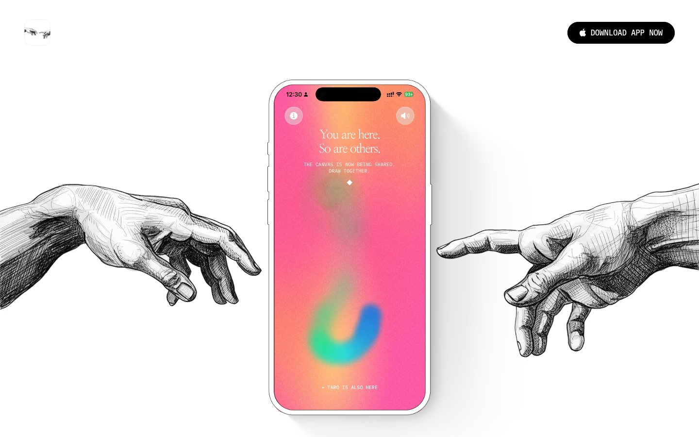
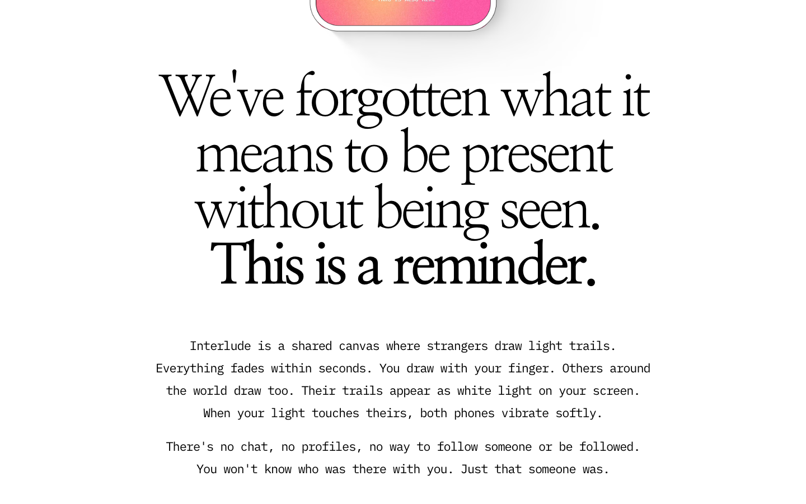
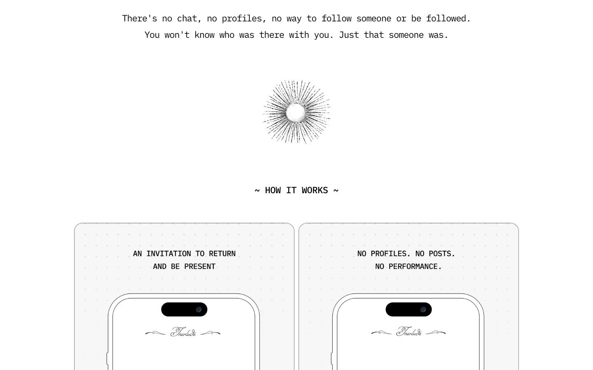
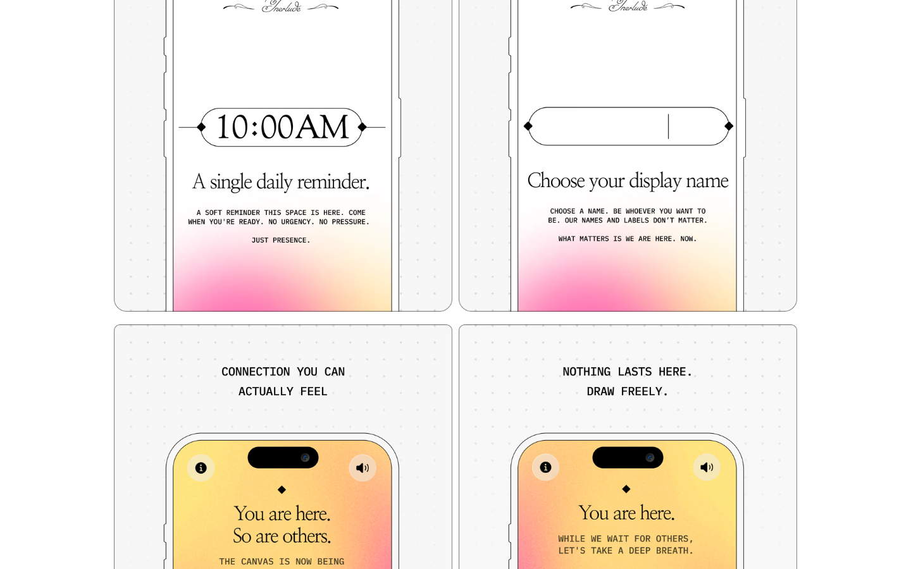
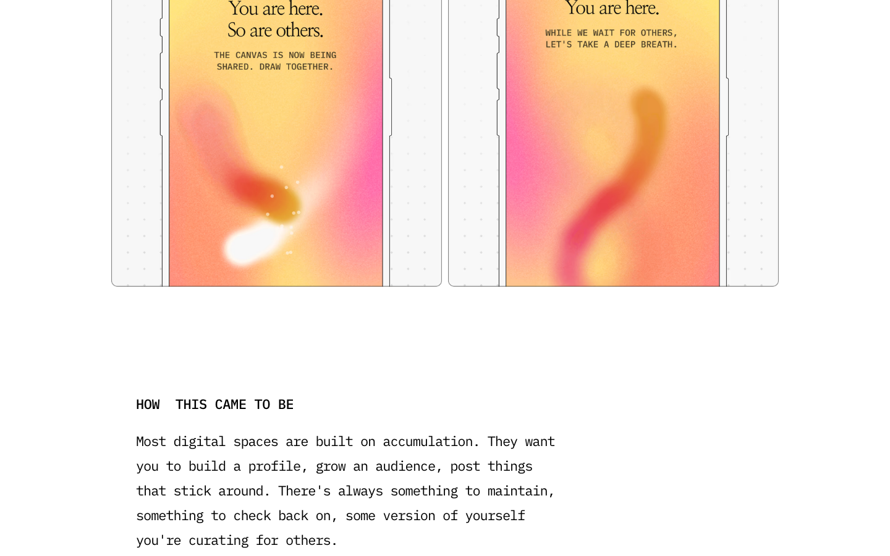
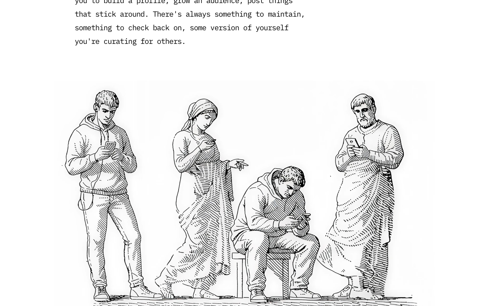
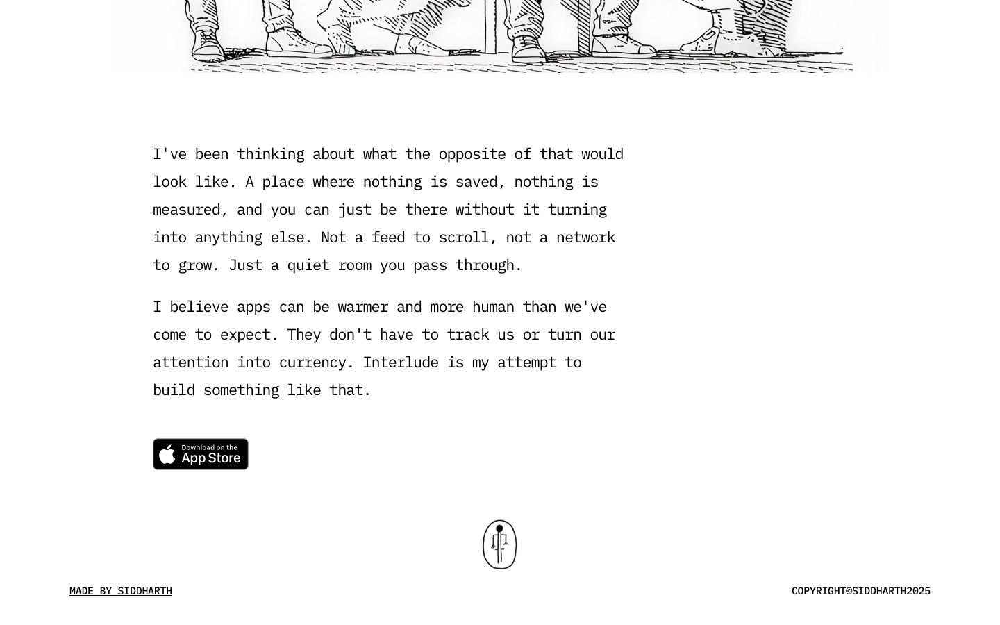
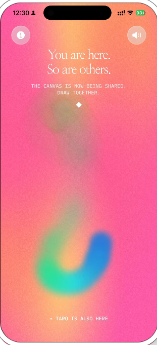
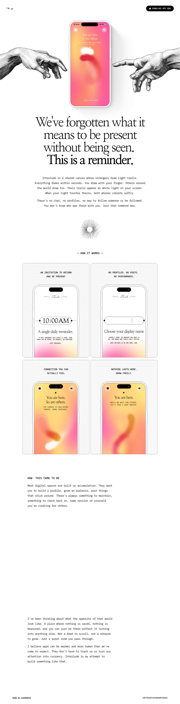

# interludeapp — Visual Guide

> Master visual reference. Study every screenshot carefully before implementing any UI.
> Match colors, layout, typography, spacing, and motion states exactly.

## Scroll Journey

The page has cinematic scroll animations. Each screenshot below shows the exact visual state at that scroll depth.
**Replicate these transitions precisely** — the design changes dramatically as you scroll.

### Hero — Above the fold

*Scroll position: 0px of 5602px total*

### 17% scroll depth

*Scroll position: 799px of 5602px total*

### 33% scroll depth

*Scroll position: 1552px of 5602px total*

### 50% scroll depth

*Scroll position: 2351px of 5602px total*

### 67% scroll depth

*Scroll position: 3150px of 5602px total*

### 83% scroll depth

*Scroll position: 3903px of 5602px total*

### Footer — End of page

*Scroll position: 4702px of 5602px total*

## Video Backgrounds

These videos play as background elements. Use first-frame as poster image while video loads.

### Video 1 (content)

*Source: `https://framerusercontent.com/assets/iXftkIHRWyygk1gHpsrKZBQSauQ.mp4...`*

## Full Page Screenshots

### Interlude

*URL: `https://interludeapp.net`*

